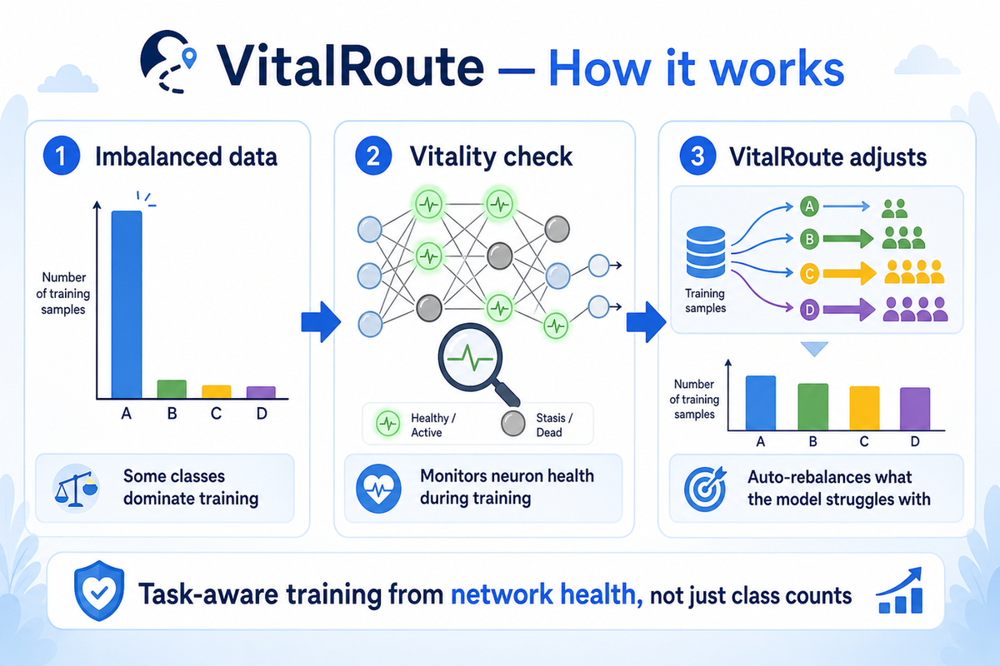

# VitalRoute

[](https://pypi.org/project/vitalroute/)
[](https://www.python.org/downloads/)
[](LICENSE)
[](tests/)

**Task-aware training controller** for feed-forward classifiers. VitalRoute wraps
the training optimizer (Adam, SGD, etc.), reads **training-set shape** (class counts
and size), and activates tactics — class oversampling, label-free transfer selection,
per-layer LR scaling — from four neuron vitality signals: stasis, weak coupling,
and saturation.

<p align="center">
  
</p>

*Imbalanced classes → monitor neuron health during training → VitalRoute steers learning toward struggling classes.*

## Vitality signals and tactics

VitalRoute monitors four per-unit stress signals:

| Signal | Meaning |
|---|---|
| **Stasis** | Hidden unit barely responds (dead ReLU, etc.) |
| **Weak weights** | Weight column has collapsed |
| **Weak input** | Incoming activations are tiny vs weights |
| **Saturation** | Unit stuck near a constant output |

From those signals, VitalRoute provides:

1. **Vitality sampler** — For **imbalanced** data, oversample classes with high
   **composite stress** (all four signals, not only stasis).
2. **Transfer pick** — For **scarce** data, selects the best pretrained parent by
   lowest stasis on the new inputs (no labels needed), then warm-starts weights.
3. **Hard-sample sampler** — When class rebalancing is off, oversample individual
   examples with high per-sample stress (stasis + weak coupling + low confidence).
4. **LR scale** — Slow learning on layers with high stasis:
   `lr_l = base_lr / (1 + α · stasis_l)` (dampens high-stasis layers at elevated base LR).
5. **Monitor** — Logs layer health; **resets** stuck units when stasis is
   high (skipped for CNN-style models with a separate head).

An **adaptive router** turns (1)–(4) on or off from class counts and dataset size.

## Install

```powershell
pip install vitalroute
# PyTorch extras (probe, CNN, MLPerf hooks):
pip install "vitalroute[torch]"
```

Package: [pypi.org/project/vitalroute](https://pypi.org/project/vitalroute/) · Requires Python 3.10+ and NumPy.

## Quick use

```python
import numpy as np
from vitalroute import adaptive_controller, profile_task, route_plan
from vitalroute.backbone import MLP, LayerSpec, Adam

# Training arrays
X_train, y_train = ...
num_classes = 10

# Preview routing (no training)
prof = profile_task(y_train, num_classes)
plan = route_plan(prof, parent_pool_available=False)
print(plan.label)  # e.g. "imbalance", "transfer", "transfer+imbalance", "monitor"

# Training loop integration
ctrl = adaptive_controller(y_train, num_classes, parent_pool=None, verbose=True)
opt = ctrl.make_optimizer("adam", lr=1e-3)  # vitality-scaled when route includes lr_scale

sampler, _ = ctrl.bootstrap(model, X_train, y_train, num_classes=num_classes)

for epoch in range(epochs):
    ctrl.on_epoch_start(model, X_train, opt, epoch)  # refresh LR scales if enabled
    if sampler is not None:
        idx = sampler.sample_indices(epoch, model, X_train, y_train, len(y_train))
        X_ep, y_ep = X_train[idx], y_train[idx]
    else:
        X_ep, y_ep = X_train, y_train
    # ... standard mini-batches, loss, optimizer step ...
    ctrl.after_epoch(model, X_train, rng=np.random.default_rng(epoch))
```

Runnable example: `examples/digits_imbalanced_demo.py`.

## Router rules (defaults)

| Condition | Enabled |
|---|---|
| `min_class / max_class < 0.25` and minority ≥ 15 samples | Vitality sampler (composite stress) |
| `n ≤ 200` or `min_class ≤ 12`, and parent pool provided | Transfer pick |
| Scarce **balanced** data | Transfer + hard-sample sampler (no class sampler) |
| `n ≥ 80`, sampler off | LR scale |
| `n ≥ 40`, sampler off | Hard-sample sampler |
| Always (when training) | Monitor (+ conditional reset) |

## How it compares to inverse-frequency weighting

On a clean long-tail benchmark, VitalRoute ≈ inverse-frequency (inv_freq). They converge to the same answer because rare classes and broken-neuron classes heavily overlap — the network sees minority classes less, so their neurons die more.

**Scenarios where VitalRoute differs from inv_freq:**

| Scenario | Distinction |
|---|---|
| Imbalanced but not uniformly scarce | A class with enough samples but high confusability (broken neurons) gets oversampled; inv_freq ignores it |
| Difficulty shifts mid-training | VitalRoute refreshes stress every N epochs; inv_freq is static |
| Label-free transfer selection | Selects the best pretrained parent by stasis on new inputs — no labels needed. inv_freq has no equivalent |
| Hard-sample curriculum | Per-sample stress (stasis + low confidence) for scarce balanced data; inv_freq only works at class level |

On long-tail data with clean class boundaries, VitalRoute and inv_freq reach similar accuracy. Use VitalRoute when classes overlap, difficulty shifts during training, or label-free transfer selection is required.

## Package layout

```text
vitalroute/
  README.md
  PAPER.md            # research paper style writeup
  INTEGRATION.md      # NumPy, PyTorch, CNN, MLPerf integration
  assets/             # README and social images (not on PyPI)
  pyproject.toml
  vitalroute/
    vitality.py         # layer stress probes + per-class/per-sample stress
    imbalance.py        # composite vitality class sampler (NumPy)
    hard_samples.py     # per-sample stress sampler (NumPy)
    lr_scale.py         # vitality-scaled Adam / SGD (NumPy)
    transfer.py         # label-free parent pick (NumPy)
    router.py           # task profile + adaptive controller (NumPy)
    torch_probe.py      # VitalityProbe — forward hooks for any nn.Module
    torch_probe_cnn.py  # CNNVitalityProbe — BatchNorm-aware conv probing
    torch_probes.py     # make_probe / detect_architecture registry
    torch_transfer.py   # PyTorch transfer pick + warm_start_from_parent
    torch_lr_scale.py   # per-layer param groups + apply_lr_scales
    torch_data.py       # stratified_probe_batch helper
    torch_samplers.py   # TorchVitalitySampler + TorchHardSampleSampler
    torch_controller.py # TorchTrainingController + torch_adaptive_controller
    mlperf_hooks.py     # VitalRouteMLPerfCallback for MLPerf-style loops
    backbone/           # optional reference MLP for demos
  examples/
    digits_imbalanced_demo.py     # NumPy backbone quick demo
    benchmark_baselines.py        # NumPy baseline comparison (digits)
    torch_probe_demo.py           # VitalityProbe on a PyTorch MLP
    torch_benchmark_fmnist.py     # PyTorch baseline comparison (Fashion-MNIST)
    cifar10_resnet_benchmark.py   # ResNet18 / CIFAR-10-LT
    cifar10_lt_benchmark.py       # CIFAR-10-LT + transfer-pick demo
    imagenet_lt_benchmark.py      # CIFAR-100-LT local / ImageNet-LT
    mlperf_resnet_integration.py  # MLPerf callback demo
    run_cnn_benchmarks.py         # run all CNN benchmarks (--quick / --full)
  tests/
```

## Evidence summary

Measured on published benchmarks:

| Setting | Measured gain |
|---|---|
| Imbalanced digits / Fashion minority classes | +2–4% minority accuracy vs uniform |
| vs inverse-frequency baseline (same imbalanced digits) | +0.7% minority, lower variance |
| Scarce CIFAR-10-LT + transfer pick (`cifar10_lt_benchmark.py`) | See script output vs cold start |
| Scarce cat/dog (MLP / CNN) | +2–3% with transfer pick |

**NumPy backbone benchmark** (`examples/benchmark_baselines.py`), 3 seeds, 30 epochs, 5:1 imbalance on digits:

```
Method         Overall    Minority
uniform        93.7%±1.1%  87.9%±2.3%
inv_freq       94.4%±0.8%  90.1%±1.0%
vitalroute     95.1%±0.3%  90.8%±1.0%
stasis_only    95.0%±0.7%  90.7%±1.5%
```

Digits benchmark: VitalRoute — 95.1% overall, 90.8% minority, lowest cross-seed variance.

**PyTorch benchmark** (`examples/torch_benchmark_fmnist.py`), 3 seeds, 20 epochs, 10:1 imbalance on Fashion-MNIST MLP:

```
Method         Overall    Minority
uniform        80.1%±0.4%  72.8%±1.2%
inv_freq       81.7%±0.5%  77.6%±0.9%
focal          80.0%±0.3%  72.6%±0.2%
vitalroute     81.7%±0.2%  76.5%±0.6%
```

Overall accuracy matches inv_freq (81.7%); minority accuracy is 1.1 points below inv_freq (76.5% vs 77.6%) but variance is lower across all seeds.

**CNN benchmark** (`examples/cifar10_resnet_benchmark.py`), ResNet18, 10:1 long-tail CIFAR-10 (classes 0–4: 1000 samples each; classes 5–9: 100 each):

| Method | Role in comparison |
|---|---|
| uniform | Unweighted sampling baseline |
| inv_freq | Inverse-frequency `WeightedRandomSampler` |
| focal | Focal loss (γ=2), uniform sampling |
| vitalroute | Adaptive vitality class sampler + `CNNVitalityProbe` |

Quick benchmark (2 epochs, CPU, 1 seed). Full run: `python examples/run_cnn_benchmarks.py --full`.

```
Method         Overall    Minority
uniform        26.6%       0.0%
inv_freq       38.7%      29.4%
focal          27.4%       0.0%
vitalroute     36.9%      33.5%
```

At epoch 2, minority accuracy is 33.5% (vitalroute) vs 29.4% (inv_freq). Uniform and focal report 0% on minority classes in this run.

### CNN long-tail: mechanisms

| Tactic | Behavior |
|---|---|
| Vitality class sampler | Oversamples classes with high composite stress on conv and head layers, not frequency alone |
| vs focal loss | Focal modulates loss per sample; VitalRoute modulates sampling from internal activation health |
| Adaptive router | Enables sampler, transfer pick, or LR scale from class counts and dataset size |
| `CNNVitalityProbe` | Reads Conv→BN→ReLU trunk and/or linear head (`probe_zone=head`, `trunk`, or `all`) |
| PyTorch transfer pick | Ranks parents by stasis on unlabeled inputs; warm-starts trunk via `warm_start_from_parent` |
| Per-layer LR | `make_optimizer()` assigns named param groups; stasis rate scales each group's learning rate |
| MLPerf callback | `VitalRouteMLPerfCallback` exposes the same epoch hooks as MLPerf reference training loops |

### Running CNN benchmarks

```powershell
pip install -e ".[dev]"
python examples/run_cnn_benchmarks.py --quick   # 2 epochs per script
python examples/run_cnn_benchmarks.py --full    # 15 epochs, multiple trials
```

## PyTorch integration

### Probe only (read vitality signals)

`VitalityProbe` attaches to any `torch.nn.Module` via forward hooks — no
changes to the model or optimizer required:

```python
from vitalroute.torch_probe import VitalityProbe

probe = VitalityProbe(model)        # attach once; pairs Linear→ReLU automatically

for epoch in range(epochs):
    train_one_epoch(model, ...)
    probe.observe(X_train)          # one forward pass, no gradients
    print(probe.summary())          # per-layer stasis + composite stress
    print(f"mean stasis: {probe.mean_stasis():.3f}")

# Per-class and per-sample stress for custom sampling
class_scores  = probe.per_class_stress(X_train, y_train, num_classes=10)
sample_scores = probe.per_sample_stress(X_train, y_train)

probe.detach()                      # remove hooks
```

### Full adaptive controller

`torch_adaptive_controller` selects tactics from the training label distribution.
For CNNs, set `architecture="cnn"` and `probe_zone` to `"head"` (classifier only),
`"trunk"` (conv blocks), or `"all"` (both).

```python
from vitalroute.torch_controller import torch_adaptive_controller
from vitalroute.torch_data import stratified_probe_batch
from torch.utils.data import DataLoader

ctrl = torch_adaptive_controller(
    y_train, num_classes=10,
    architecture="cnn",
    probe_zone="all",
    parent_pool=None,   # optional: [("parent_a", model_a), ...]
    verbose=True,
)

X_probe, y_probe, _ = stratified_probe_batch(
    train_dataset, y_train, per_class=50, num_classes=10, device="cuda"
)
sampler = ctrl.setup(model, X_probe, y_probe, y_full=y_train, num_classes=10)
optimizer = ctrl.make_optimizer(model, torch.optim.SGD, lr=0.05, momentum=0.9)

loader = DataLoader(dataset, sampler=sampler, batch_size=64) if sampler else DataLoader(dataset, batch_size=64, shuffle=True)

for epoch in range(epochs):
    ctrl.on_epoch_start(model, X_probe, optimizer, epoch)
    for X_batch, y_batch in loader:
        ...  # standard loss + backward + step
    ctrl.after_epoch(model, X_probe, y_probe)

ctrl.detach()
```

### MLPerf Training integration

`VitalRouteMLPerfCallback` wraps `TorchTrainingController` in an epoch callback
interface aligned with MLPerf reference training loops. See `INTEGRATION.md` and
`examples/mlperf_resnet_integration.py`.

Runnable examples: `examples/torch_probe_demo.py`, `examples/torch_benchmark_fmnist.py`,
`examples/cifar10_resnet_benchmark.py`, `examples/run_cnn_benchmarks.py`.

## License

MIT

## Contributing

Contributions are welcome. See [CONTRIBUTING.md](CONTRIBUTING.md) for setup,
PR requirements, and code guidelines. Please read [CODE_OF_CONDUCT.md](CODE_OF_CONDUCT.md)
before participating. Report security issues via [SECURITY.md](SECURITY.md), not
public issues.

## Related Work

The following related work is grouped by topic. Distinctions from VitalRoute are noted per entry.

**Adaptive class resampling**
- [ART: Adaptive Resampling-based Training for Imbalanced Classification](https://arxiv.org/abs/2509.00955) (2025) — periodically refreshes class sampling weights using class-wise F1 scores. VitalRoute uses internal neuron health signals instead of output metrics.

**Dead neuron analysis and pruning**
- [When to Prune? A Policy towards Early Structural Pruning](https://openreview.net/pdf?id=2wFXD2upSQ) — uses dead-neuron rates to guide structured pruning during training. VitalRoute uses the same signal to drive *sampling*, not pruning.
- [Dead neurons in Deep Learning (overview)](https://medium.com/@abhishekjainindore24/dead-neurons-in-deep-learning-their-effects-and-remedies-to-solve-it-e63da4dd9212)

**Dynamic network structure for imbalanced learning**
- [Adaptive Neuron Growth/Pruning for Imbalanced Classification](https://arxiv.org/abs/2507.09940) (2025) — adds/removes neurons per class using gradient magnitude. Orthogonal to VitalRoute: modifies architecture rather than sampling.

**Per-layer learning rate scaling**
- [LENA: Layer-wise Adaptive LR Scaling](https://dl.acm.org/doi/fullHtml/10.1145/3485447.3511989) — scales per-layer LR by gradient variance. VitalRoute scales by stasis (dead-unit fraction).
- [LLR: Heavy-Tail Guided Layerwise LR for LLMs](https://arxiv.org/html/2605.22297v1) (2025) — uses weight spectrum heavy-tailedness. Same goal, different diagnostic.
- [AdaLip: Adaptive LR per Layer via Lipschitz Estimation](https://d-nb.info/1283272997/34) — Lipschitz-constant-based per-layer LR.
- [LARS](https://arxiv.org/abs/1708.03888) / [LAMB](https://arxiv.org/abs/1904.00962) — weight/gradient ratio scaling; used in large-batch distributed training.

**Label-free transfer model selection**
- [TURTLE: Unsupervised Transfer Learning](https://arxiv.org/html/2406.07236v1) (2024) — selects pretrained models without labels via representation-level generalization objectives. VitalRoute selects parents by lowest stasis on unlabeled target inputs.
- [DISCO: Spectral Component Distribution for Transfer Assessment](https://arxiv.org/html/2412.19085v2) (2024) — SVD of feature distributions for transferability scoring.

**Focal Loss (baseline used in benchmarks)**
- [Focal Loss for Dense Object Detection](https://arxiv.org/abs/1708.02002) — Lin et al., 2017. Standard hard-example weighting via loss modulation.

**Curriculum / hard-sample learning**
- [Self-Paced Learning](https://papers.nips.cc/paper_files/paper/2010/hash/e57c6b956a6521b28495f2886ca0977a-Abstract.html) — Kumar et al., NeurIPS 2010. Curriculum-style training from latent difficulty.
- [Online Hard Example Mining](https://arxiv.org/abs/1604.03540) — Shrivastava et al., 2016. Per-sample difficulty weighting from loss values.

